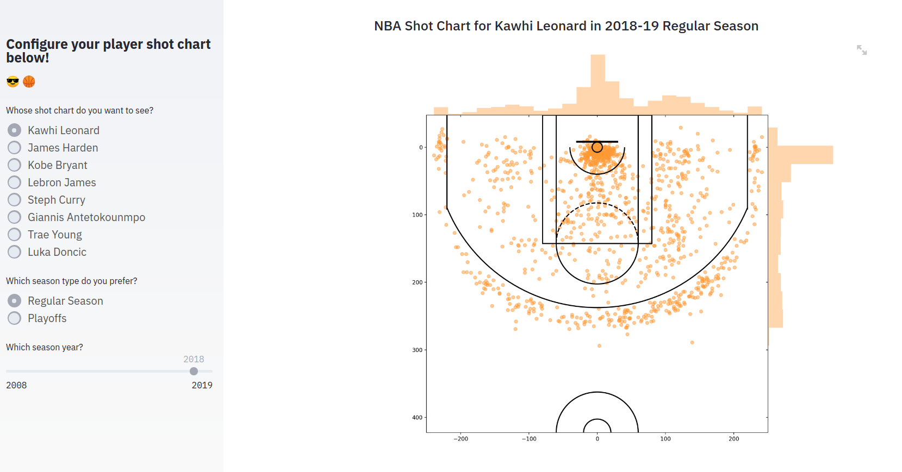

# nba-shot-chart-streamlit
This app was created as part of an exploration of the [`Streamlit`](https://www.streamlit.io/) app development package with fast updates. 

The app utilises the functionalities of `streamlit` with instantaneous app updates via widgets interaction. By interacting with the widget settings (player name, season type, season year), the app pulls data from [the NBA Stats website](https://stats.nba.com/) with pretty fast updates!

Check it out for yourself!

<p align = "center">
    
</p>

## Method 1
To set up the app, clone the repo and install the requirements. Thereafter, you can run the `streamlit` command to set it up, and open the relevant url on your local browser.

```
git clone https://github.com/kfoofw/nba-shot-chart-streamlit

# change to project repo
cd nba-shot-chart-streamlit

# Install requirements
pip install -r requirements.txt

# Use streamlit to set up the app
streamlit run nba_shot_chart.py
```
## Method 2
To run the app with Docker (assuming you have it installed), clone the repo and build the image.

```
git clone https://github.com/kfoofw/nba-shot-chart-streamlit

# change to project repo
cd nba-shot-chart-streamlit

# run Docker
docker build -t nba-shot-chart-streamlit .
```

Open the resultant url to access the app locally. Enjoy!
